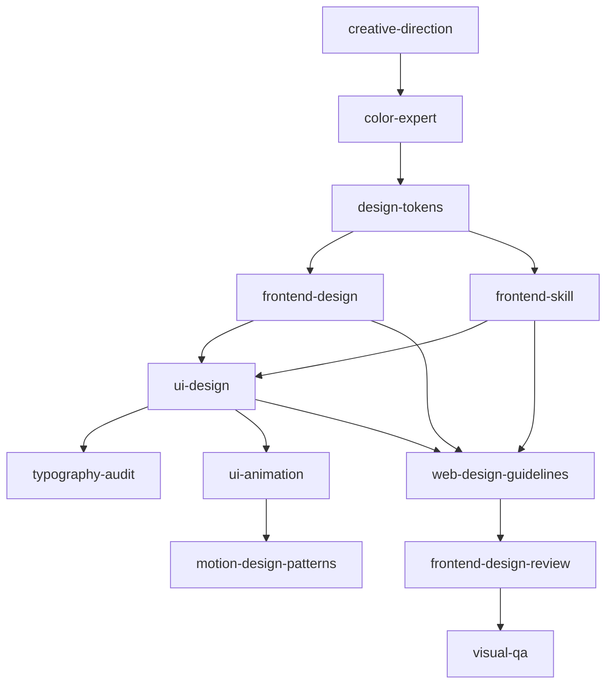
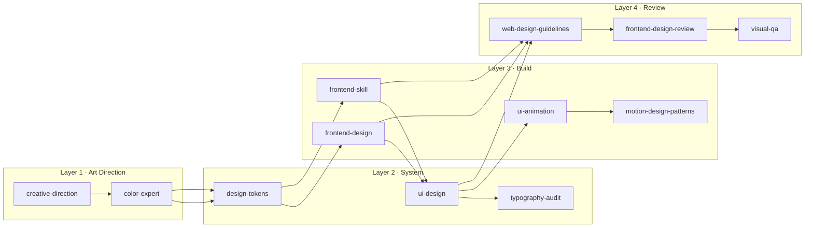

# Frontend Creative Skill Graph

```mermaid
graph TD
  A[creative-direction] --> B[color-expert]
  B --> C[design-tokens]
  C --> D[frontend-design]
  C --> E[frontend-skill]
  D --> F[ui-design]
  E --> F
  F --> G[typography-audit]
  F --> H[ui-animation]
  H --> I[motion-design-patterns]
  D --> J[web-design-guidelines]
  E --> J
  F --> J
  J --> K[frontend-design-review]
  K --> L[visual-qa]
```

```mermaid
graph LR
  subgraph L1[Layer 1 · Art Direction]
    A1[creative-direction]
    A2[color-expert]
  end

  subgraph L2[Layer 2 · System]
    B1[design-tokens]
    B2[ui-design]
    B3[typography-audit]
  end

  subgraph L3[Layer 3 · Build]
    C1[frontend-design]
    C2[frontend-skill]
    C3[ui-animation]
    C4[motion-design-patterns]
  end

  subgraph L4[Layer 4 · Review]
    D1[web-design-guidelines]
    D2[frontend-design-review]
    D3[visual-qa]
  end

  A1 --> A2 --> B1 --> C1
  A2 --> B1 --> C2
  C1 --> B2
  C2 --> B2
  B2 --> B3
  B2 --> C3 --> C4
  C1 --> D1
  C2 --> D1
  B2 --> D1 --> D2 --> D3
```
