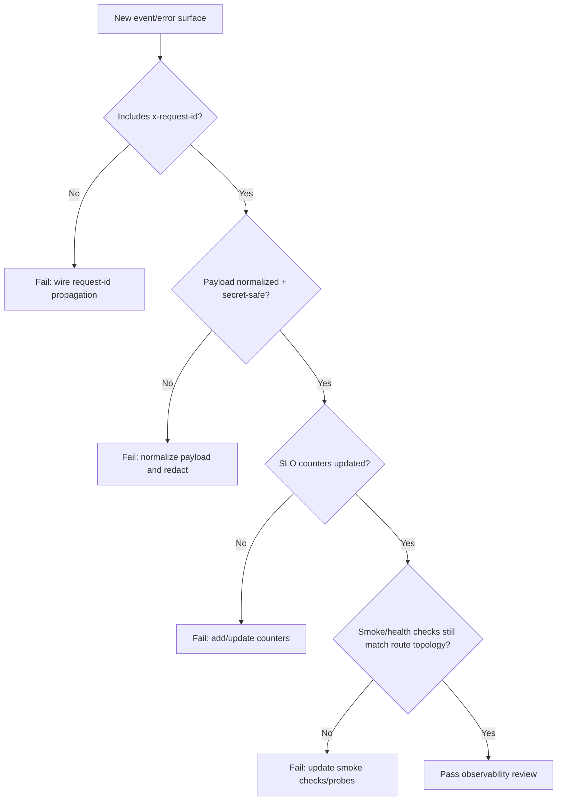
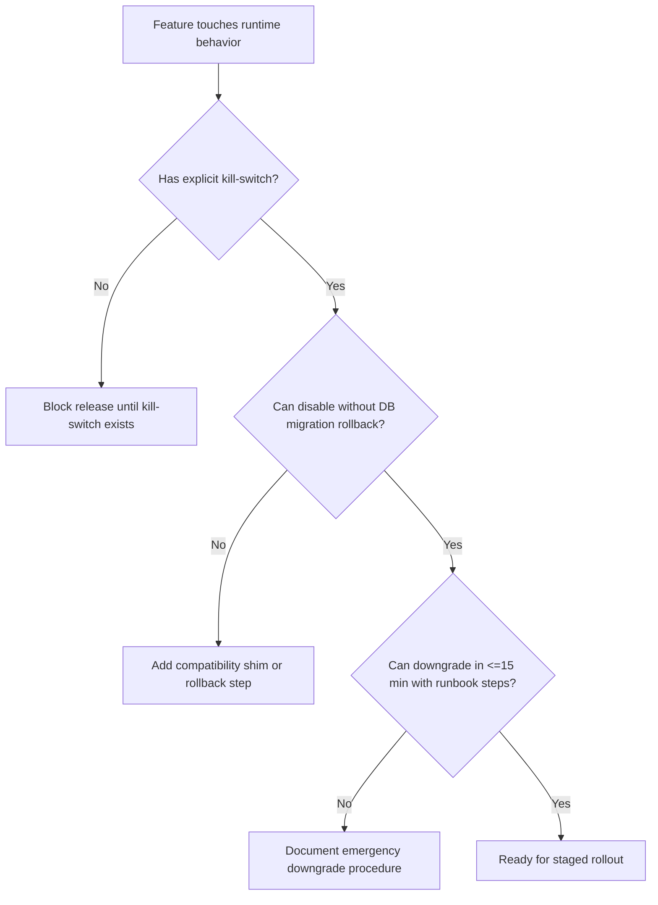

# Policy + Verification Bundle (High-Rigor)

Use this bundle when a change has a medium-high risk profile, broad blast radius, or unclear fallback behavior. This is the "most robust, highest-effort" baseline.

## Conventions

- Preserve explicit dual-path behavior (`demo` default mock path, `admin` gated live path) for every changed flow.
- Encode fallback-first behavior: integration failures must degrade to a usable surface with safe copy and no secret leakage.
- Keep observability normalized end-to-end:
  - request correlation via `x-request-id`
  - structured logs only
  - safe, normalized error payloads
  - release smoke coverage aligned with public `web` ingress
- Treat UI states as a contract (not a cosmetic detail): loading, empty, success, recoverable error, and degraded-fallback states must be explicit.
- Couple rollout and rollback design to kill-switches before merge; do not ship behavior that cannot be disabled quickly.

## Decision Trees

### 1) Demo/Admin Parity Decision Tree

```mermaid
flowchart TD
  A[Changed route/loader/action] --> B{Does demo branch short-circuit first?}
  B -- No --> B1[Fail: P0/P1 depending on data/provider touch]
  B -- Yes --> C{Any DB/provider call reachable in demo?}
  C -- Yes --> C1[Fail: add guard + negative test]
  C -- No --> D{Are admin writes gated by session or signed internal state?}
  D -- No --> D1[Fail: restore admin guard]
  D -- Yes --> E{SSR first render stable (no demo/admin flash)?}
  E -- No --> E1[Fail: fix auth resolution path]
  E -- Yes --> F[Pass dual-path review]
```

### 2) Observability/Failure Decision Tree



### 3) Rollback/Kill-switch Decision Tree



## Required Verification Checklist

Use this checklist in PR notes for medium-high risk changes.

### A. Demo/Admin Dual-Path Acceptance Criteria

#### Demo path (must all pass)
- Deterministic mock data renders for all touched routes/components.
- No DB, Redis, or provider side effects from demo execution path.
- Sensitive actions are visibly disabled or read-only.
- Error/fallback messaging stays actionable (no dead-end state).

#### Admin path (must all pass)
- Authenticated admin can perform expected reads/writes.
- Unauthorized/non-admin attempts fail with safe payloads.
- SSR auth resolves admin on first render without demo flash.
- Provider/API failures degrade to partial-but-usable UI.

#### Required negative tests
- Demo request never triggers live provider call.
- Demo request never writes DB state (even through helper paths).
- Admin-only mutation denied without valid session/signed state.
- Invalid provider callback/auth-state fails closed with safe error body.

### B. Observability Contract Acceptance Criteria

- `x-request-id` exists in:
  - ingress request context
  - structured log events
  - error payload surface where already contractually exposed
- Event and error payloads are normalized and safe.
- Smoke checks and probes still cover affected route topology.

#### Normalized payload examples

**Event (structured log)**

```json
{
  "level": "info",
  "event": "dashboard.summary.fetch",
  "requestId": "req_123",
  "mode": "demo",
  "status": "fallback",
  "reasonCode": "provider_unavailable",
  "safeContext": {
    "route": "/dashboard/summary"
  }
}
```

**Error payload (safe for clients)**

```json
{
  "ok": false,
  "error": {
    "code": "POWENS_SYNC_DEGRADED",
    "message": "Sync is temporarily unavailable. Showing last safe snapshot.",
    "requestId": "req_123"
  }
}
```

#### SLO-facing counters (minimum set)
- `finance_os_request_total{route,mode,status}`
- `finance_os_request_error_total{route,mode,error_code}`
- `finance_os_fallback_total{route,dependency,reason_code}`
- `finance_os_degraded_serving_total{surface,mode}`

## UI/UX State Catalog + Screenshot Expectations

For each touched UI surface, explicitly document whether every state below exists and how it is reached.

- Loading (skeleton/preloaded content strategy)
- Empty (first-use/no-data)
- Success (fresh data)
- Degraded success (stale-but-usable/fallback snapshot)
- Recoverable error (retry path)
- Blocking error (if truly unavoidable)
- Offline/network-loss hint (if applicable)
- Permission-gated (demo/admin affordance differences)
- In-progress mutation + post-success confirmation

### Screenshot expectations for review

Include screenshots for:
1. Primary success state (desktop).
2. Degraded fallback state with safe explanatory copy.
3. Error/retry state.
4. Demo/admin gating evidence when UI affordances differ.

If a state is hard to force, explain deterministic repro steps in PR notes.

## Staged Rollout + Emergency Downgrade

### Staged rollout policy

1. **Dark launch**: land code paths behind a runtime kill-switch (default off in production).
2. **Internal enablement**: enable for admin path only and validate smoke + manual checklist.
3. **Progressive exposure**: widen to intended audience while monitoring SLO counters and fallback rates.
4. **Steady-state**: remove temporary guards only after at least one stable release window.

### Emergency downgrade procedure

1. Flip the runtime kill-switch to disable the risky path.
2. Confirm health and smoke checks (`/health`, `/auth/me`, `/dashboard/summary`, `/integrations/powens/status`).
3. Verify demo/admin parity remains intact in safe mode.
4. Announce incident status with request-id samples and normalized reason codes (no secrets).
5. If needed, redeploy last known good image tag (immutable tag, never `latest`).

## Risk and Delivery Guidance

- Expected risk profile: **medium-high** for this bundle due to larger change surface and verification overhead.
- Delivery tradeoff: this policy can slow immediate throughput but significantly lowers fallback/contract regressions.
