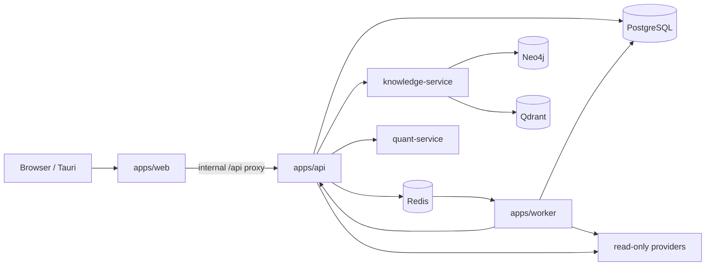

# Architecture

## Topology

Only `apps/web` receives public traffic. The API, worker, knowledge service, quant service, PostgreSQL, Redis, Neo4j, and Qdrant are internal runtime surfaces.

## Applications

| Application | Contract |
|---|---|
| `web` | TanStack Start SSR, route loaders, query cache, responsive Command Pixel UI, `/api` proxy |
| `api` | Elysia routes, admin/internal auth, normalized errors, domain use cases, repositories |
| `worker` | Typed Redis queues, schedules, ingestion, derived recompute, heartbeat |
| `knowledge-service` | Internal temporal graph ingestion/retrieval with provenance and contradiction history |
| `quant-service` | Isolated read-only research/backtesting; no brokerage execution |
| `desktop` | Tauri packaging and platform shell; it does not fork product logic |

## Shared packages

- `finance-engine`: deterministic calculations and financial rules.
- `ai`: model/provider contracts, run status, and cost/audit primitives.
- `db`: Drizzle schema and PostgreSQL client.
- `env`: authoritative runtime schemas and diagnostics.
- `powens` and `external-investments`: provider clients, jobs, and normalization boundaries.
- `provider-contract` and `provider-runtime`: provider capability, health, redaction, and the Effect 3 operation policy (`provider-runtime/policy`: bounded timeout, transient-only exponential retry, cancellation through the caller's AbortSignal) that every external client goes through.
- `redis`: real and deterministic in-memory Redis contracts.
- `prelude`: shared errors/logging-safe primitives.
- `api-contract`: transport-only Zod schemas and inferred DTO types for the financial API responses shared by `api` and `web` (`null` means unknown, never 0).
- `styled-system`: Command Pixel design tokens as a Panda CSS preset, the single Panda config, and the generated (gitignored) styling runtime.
- `ui`: shared components built on the styled-system.

## Demo and admin

`demo` is resolved when no valid admin session exists. Routes use deterministic fixtures and never reach database/provider/write branches. `admin` may access live state after the appropriate session; explicitly guarded server-to-server routes may instead accept the static `PRIVATE_ACCESS_TOKEN`. The API authenticates to the knowledge and quant services with the separate server-only `INTERNAL_SERVICE_TOKEN` (`x-internal-service-token`), which those services enforce on all routes except `/health` and `/version` and which production requires at startup. Powens callback state is HMAC-signed and is not an internal API token. The web root auth flow uses `/auth/me`; SSR uses `API_INTERNAL_URL`, while browsers stay on the `/api` proxy.

Mode separation is an execution boundary, not merely a UI flag. Tests must prove the forbidden calls are absent in demo.

## Data authority

1. Provider/source rows and deterministic fixtures are primary inputs.
2. Repositories normalize them into versioned domain contracts.
3. `finance-engine` produces deterministic calculations.
4. Analytics, knowledge graph, and LLM output are derived consumers, never execution dependencies or transaction sources of truth.

Every metric or chart names one canonical table/view, API contract, or demo fixture. Time window, timezone, freshness, currency/FX, null, and sampling assumptions belong with that contract.

## Request and job observability

The edge accepts or creates `x-request-id`; web, API, jobs, worker callbacks, logs, and safe error payloads propagate it. Logs are structured and secret-safe. Provider failures are isolated and reported as degraded states.

## Deployment architecture

Production Compose is `docker-compose.prod.yml`; the release workflow publishes web, API, worker, knowledge-service, and quant-service images to GHCR and updates the immutable `APP_IMAGE_TAG` in Dokploy. See [Deployment](deployment.md).
