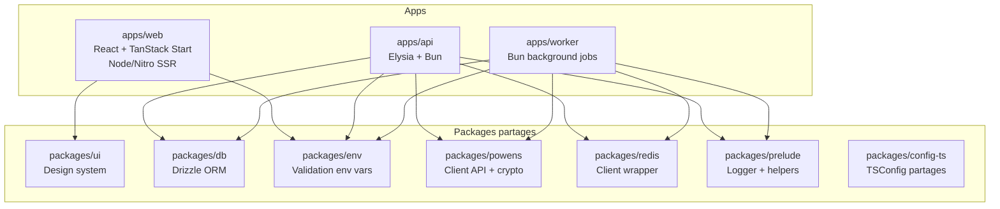
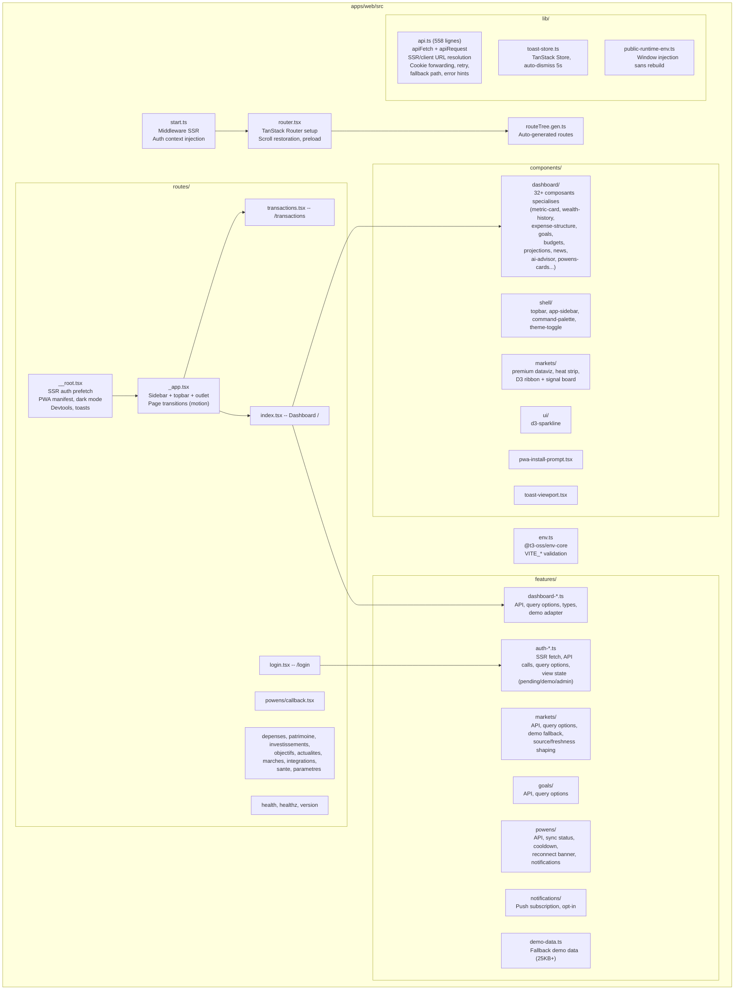
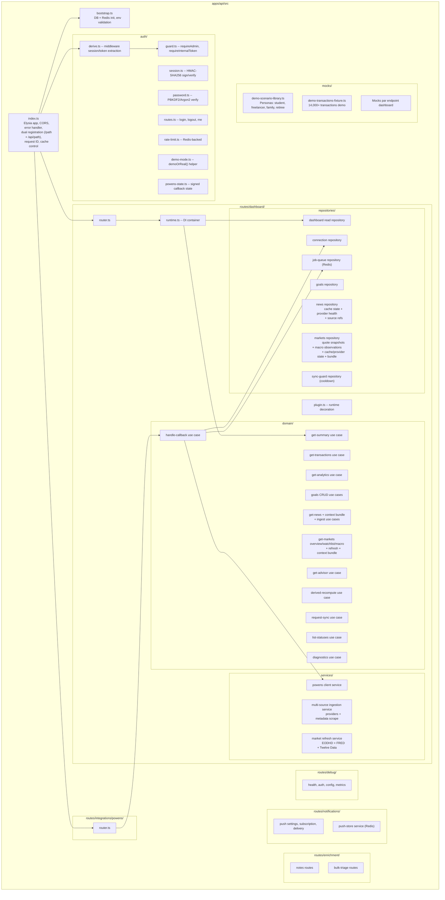
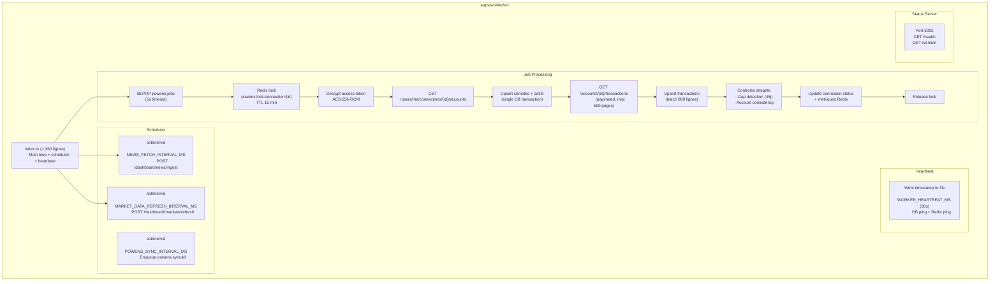
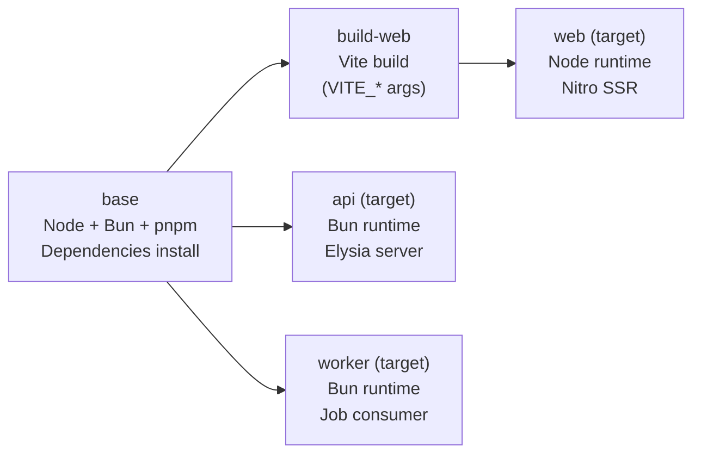

# Finance-OS -- Architecture par App & Package

> **Derniere mise a jour** : 2026-04-10
> **Maintenu par** : agents (Claude, Codex) + humain
> Mettre a jour lors d'ajout de modules, routes, ou packages.

---

## Vue d'ensemble monorepo



---

## 1. apps/web -- Frontend

**Runtime** : Node.js 22 (Nitro SSR) | **Framework** : React 19 + TanStack Start



### Patterns cles
- **SSR-first** : auth prefetch dans root loader, route loaders pour data concurrent
- **Mode-aware queries** : options separees admin/demo, fallback demo sur erreur
- **API client intelligent** : resolution URL client/SSR/fallback, cookie forwarding, retry
- **Runtime env** : config injectee dans `window.__FINANCE_OS_PUBLIC_RUNTIME_ENV__` sans rebuild

---

## 2. apps/api -- Backend API

**Runtime** : Bun 1.2+ | **Framework** : Elysia



### Layering

```
Route handler (HTTP in/out)
  -> Auth guard (demo/admin/token)
    -> Use case (business logic)
      -> Repository (data access, demoOrReal split)
        -> DB (Drizzle) or Redis or Mock fixture
      -> Service (external provider call)
```

### Routes enregistrees

| Prefixe | Domaine | Routes |
|---|---|---|
| `/auth` | Authentification | login, logout, me |
| `/dashboard` | Cockpit | summary, transactions, analytics, goals, news, news/context, markets, advisor, derived-recompute |
| `/integrations/powens` | Banques | connect-url, callback, sync, status, audit-trail, backlog, sync-runs, diagnostics |
| `/enrichment` | Enrichissement | notes, bulk-triage |
| `/notifications/push` | Notifications | settings, subscription, delivery |
| `/debug` | Debug | health, auth, config, metrics |
| `/health`, `/version` | Systeme | Liveness, version |

---

## 3. apps/worker -- Background Jobs

**Runtime** : Bun 1.2+ | **Pattern** : Redis BLPOP consumer



### Types de jobs

| Type | Declencheur | Action |
|---|---|---|
| `powens.syncConnection` | Manual sync, callback | Sync une connexion specifique |
| `powens.syncAll` | Scheduler auto-sync | Sync toutes les connexions actives |

### Metriques Redis (par le worker)

| Cle | Type | Retention |
|---|---|---|
| `powens:metrics:sync:count:{date}` | Counter | 3 jours |
| `powens:metrics:powens_calls:count:{date}` | Counter | 3 jours |
| `powens:metrics:sync_status:count:{status}:{code}:{date}` | Counter | 3 jours |
| `powens:metrics:sync:runs` | List (max 40) | 30 jours |

---

## 4. packages/db -- Base de donnees

**ORM** : Drizzle | **Driver** : postgres-js | **Dialect** : PostgreSQL

```
packages/db/
  src/
    client.ts          # createDrizzleClient(url) -> db instance
    schema/
      index.ts         # Re-export all schemas
      powens.ts        # powens_connection, financial_account, transaction, provider_raw_import
      goals.ts         # personal_goal
      assets.ts        # asset, investment_position
      recurring.ts     # recurring_commitment, recurring_commitment_transaction_link
      news.ts          # news_article, news_article_source_ref, news_cache_state, news_provider_state
      markets.ts       # market_quote_snapshot, market_macro_observation, market_cache_state, market_provider_state, market_context_bundle_snapshot
      derived.ts       # derived_recompute_run, derived_transaction_snapshot
      enrichment.ts    # enrichment_note
    index.ts           # Main export (client + schema)
  drizzle/             # Migration files (.sql)
  drizzle.config.cjs   # Drizzle Kit config
```

### Tables principales

| Table | Cle unique | Relations |
|---|---|---|
| `powens_connection` | `powens_connection_id` | -> financial_account, transaction |
| `financial_account` | `(powens_connection_id, powens_account_id)` | -> transaction |
| `transaction` | `(powens_connection_id, powens_transaction_id)` OU hash fallback | -> enrichment_note |
| `personal_goal` | `id` (UUID) | standalone |
| `asset` | `id` | -> investment_position |
| `investment_position` | `id` | -> asset |
| `news_article` | `dedupe_key` (stable signal key) | -> news_article_source_ref |
| `news_article_source_ref` | `(provider, provider_article_id)` | -> news_article |
| `news_provider_state` | `provider` | standalone |
| `market_quote_snapshot` | `instrument_id` | standalone |
| `market_macro_observation` | `(series_id, observation_date)` | standalone |
| `market_provider_state` | `provider` | standalone |
| `recurring_commitment` | `id` | -> recurring_commitment_transaction_link |

---

## 5. packages/powens -- Client Powens

```
packages/powens/src/
  client.ts    # createPowensClient() - HTTP client avec retry
  crypto.ts    # encryptString(), decryptString() - AES-256-GCM
  jobs.ts      # parsePowensJob(), serializePowensJob() - serialisation Redis
  types.ts     # PowensAccount, PowensTransaction, PowensApiError
  index.ts     # Re-exports
```

### Client HTTP
- Fetch natif avec AbortController (timeout 30s)
- Retry : 2 max sur 408/429/5xx
- Backoff : `250ms * (attempt + 1)`
- Custom `PowensApiError` avec statusCode

### Crypto
- Algorithme : AES-256-GCM
- IV : 12 bytes random
- Auth Tag : 16 bytes
- Format stocke : `v1:base64(iv):base64(authTag):base64(encrypted)`
- Cle : `APP_ENCRYPTION_KEY` (32 bytes exact, accepte raw/hex/base64)

---

## 6. packages/env -- Validation environnement

```
packages/env/src/
  index.ts     # getApiEnv(), getWorkerEnv() - Zod schemas
```

- Validation stricte au demarrage (crash si invalide)
- Support multi-format password hash (PBKDF2/Argon2, plain/base64)
- Validation longueur cle encryption (32 bytes exact)
- Validation longueur session secret (32+ bytes)
- Parsing URL pour tous les champs URL

---

## 7. packages/redis -- Client wrapper

```
packages/redis/src/
  index.ts     # createRedisClient(url) -> { client, connect, ping, close }
```

- Wrapper leger autour de `node-redis`
- Expose : `client` (raw), `connect()`, `ping()`, `close()`

---

## 8. packages/ui -- Design system

```
packages/ui/
  src/
    styles/
      globals.css      # Tokens CSS (OKLch), theme light/dark, textures, utilities
    components/
      ui/
        button.tsx     # 6 variantes x 7 tailles, CVA
        badge.tsx      # 6 variantes, pill rounded-full
        card.tsx       # Header/Title/Description/Action/Content/Footer
        input.tsx      # File support, aria-invalid
        avatar.tsx     # Radix, image+fallback+badge+group
        separator.tsx  # Horizontal/vertical
      index.ts         # Re-exports
    lib/
      utils.ts         # cn() = clsx + tailwind-merge
  package.json         # Exports: styles.css, lib/utils, components
```

### Exports package

```typescript
import '@finance-os/ui/styles.css'
import { cn } from '@finance-os/ui/lib/utils'
import { Button, Card, Badge } from '@finance-os/ui/components'
```

---

## 9. packages/prelude -- Utilitaires

```
packages/prelude/src/
  logger.ts    # JSON structured logger
  version.ts   # Runtime version resolution
  health.ts    # Health check builders
  errors.ts    # Error serialization helpers
  index.ts     # Re-exports
```

---

## 10. packages/config-ts -- Configs TypeScript

```
packages/config-ts/
  base.json    # ES2023, ESNext, strict, exactOptionalPropertyTypes
  web.json     # Extends base + DOM types + React JSX
  server.json  # Extends base + Node types
```

---

## 11. infra/ -- Infrastructure

```
infra/
  docker/
    Dockerfile                    # Multi-stage: build-web, web, api, worker
    docker-compose.dev.yml        # Dev: postgres + redis
    healthchecks/                 # Scripts healthcheck containers
docker-compose.prod.yml           # Prod: web + api + worker + postgres + redis + ops-alerts
docker-compose.prod.build.yml     # Build local
docker-compose.prod.https.yml     # Caddy reverse proxy HTTPS
```

### Dockerfile multi-stage


