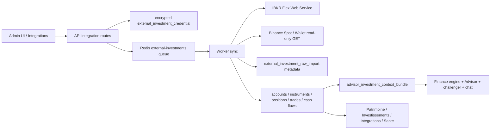

# External Investment Ingestion

> Last updated: 2026-05-01
> Maintained by agents + human

Finance-OS supports read-only ingestion for external investment providers. This feature is analytics-only: it stores reporting facts, normalizes them into canonical investment entities, and builds a compact Advisor context bundle. It is not trading infrastructure.

## Safety Boundary

Never implement or enable:

- order placement, order cancellation, trading, rebalancing execution
- Binance withdrawals, transfers, convert, margin, futures, earn/staking mutations
- IBKR trading APIs or Client Portal trading endpoints
- hidden abstractions that can later execute trades without a new explicit design review

Provider calls happen only from admin/internal sync actions or worker jobs. Dashboard reads are cache-only. Demo mode uses deterministic fixtures and makes no DB writes or provider calls.

## Data Flow

## Database Model

Core tables:

- `external_investment_connection`
- `external_investment_credential`
- `external_investment_sync_run`
- `external_investment_provider_health`
- `external_investment_raw_import`
- `external_investment_account`
- `external_investment_instrument`
- `external_investment_position`
- `external_investment_trade`
- `external_investment_cash_flow`
- `external_investment_valuation_snapshot`
- `advisor_investment_context_bundle`

Canonical rows keep provider provenance, raw import references, confidence, assumptions, degradation reasons, freshness, known and unknown valuations, cost basis status, P/L when known, fees, and cash-flow categories. Unknown values remain explicit unknowns.

## Credentials

Credentials are configured in `/integrations` in admin mode and stored encrypted with `APP_ENCRYPTION_KEY`.

IBKR supports:

- Flex token
- one or more Flex Query IDs
- optional account alias
- optional expected account IDs as masked metadata
- optional base URL and User-Agent override

Binance supports:

- Spot API key
- Spot API secret
- optional account alias
- optional base URL
- permissions metadata and IP restriction note

Credential APIs never return decrypted values. UI receives only masked secret references and non-secret metadata. Binance credentials with trading or withdrawal permission flags are rejected as `PROVIDER_PERMISSION_UNSAFE`.

## IBKR Flex

Official docs used: <https://www.interactivebrokers.com/campus/ibkr-api-page/flex-web-service/>

Finance-OS uses IBKR Flex Web Service as a reporting mechanism:

1. `FlexStatementService.SendRequest` with token and configured Query ID.
2. Retrieve the reference code.
3. `FlexStatementService.GetStatement` with token and reference code.
4. Parse XML with attributes preserved.
5. Normalize account information, open positions, trades, commissions, cash transactions, dividends, interest and fees when present.

User-Agent is required by configuration. Flex provider errors are normalized into safe Finance-OS error codes. Temporary async/report-generation issues are retryable. No IBKR Client Portal or trading endpoint is used.

## Binance Spot / Wallet

Official docs used:

- Spot Account endpoints: <https://developers.binance.com/docs/binance-spot-api-docs/rest-api/account-endpoints>
- Wallet deposit history: <https://developers.binance.com/docs/wallet/capital/deposite-history>
- Wallet all coins information: <https://developers.binance.com/docs/wallet/capital/all-coins-info>

Allowed signed `GET` endpoints:

- `/api/v3/account`
- `/api/v3/myTrades`
- `/api/v3/exchangeInfo`
- `/api/v3/time`
- `/sapi/v1/capital/deposit/hisrec`
- `/sapi/v1/capital/withdraw/history`
- `/sapi/v1/capital/config/getall`

The read-only client rejects non-GET methods and any endpoint outside the allowlist, including orders, withdraw apply, transfers, convert, margin, futures, staking and earn mutations. HMAC signing happens server-side in the worker. Logs and diagnostics never expose API keys, secrets, signatures, signed URLs, or sensitive query strings.

Withdraw history is stored only as historical read-only cash-flow facts; no withdrawal operation exists.

## Valuation

Valuation is deterministic and conservative:

1. provider-reported value when present
2. existing market cache when available through canonical storage
3. manual value if already represented in Finance-OS canonical assets
4. unknown valuation with `VALUATION_PARTIAL`

The feature does not add a paid market-data dependency and does not fetch market prices from UI reads. Crypto balances without reliable persisted value remain unknown.

## Advisor Bundle

`advisor_investment_context_bundle` stores schema version `2026-05-01` and compact facts only:

- provider coverage, health, freshness
- total known value and unknown value counts
- allocations by asset class, provider, account and currency
- top concentrations, crypto/stablecoin exposure, cash drag
- recent trades and cash flows
- fees and P/L when known
- unknown cost basis, stale data and missing market data warnings
- FX assumptions, risk flags, opportunity flags, confidence and provenance

The Advisor consumes this bundle, never raw provider JSON/XML. The finance engine also receives assumptions from this bundle so recommendations and grounded chat can state what is known, unknown, stale or degraded.

## Manual Refresh

The manual `Tout rafraichir et analyser` mission now runs:

1. personal/Powens sync when configured
2. IBKR sync when configured
3. Binance sync when configured
4. news refresh
5. markets refresh
6. investment context bundle generation
7. Advisor run

IBKR failure does not block Binance. External investment failures do not block news, markets or Advisor; they mark the operation degraded with request IDs and safe reason codes.

## Environment

Server-only app-level settings:

- `EXTERNAL_INVESTMENTS_ENABLED`
- `EXTERNAL_INVESTMENTS_SAFE_MODE`
- `EXTERNAL_INVESTMENTS_SYNC_COOLDOWN_SECONDS`
- `EXTERNAL_INVESTMENTS_STALE_AFTER_MINUTES`
- `IBKR_FLEX_ENABLED`
- `IBKR_FLEX_BASE_URL`
- `IBKR_FLEX_USER_AGENT`
- `IBKR_FLEX_TIMEOUT_MS`
- `BINANCE_SPOT_ENABLED`
- `BINANCE_SPOT_BASE_URL`
- `BINANCE_SPOT_RECV_WINDOW_MS`
- `BINANCE_SPOT_TIMEOUT_MS`

Provider credentials are not env vars. They are encrypted in DB through the admin credential routes.

## Operations

Diagnostics live in `/integrations` and `/sante`:

- provider configured/missing state
- provider health
- last success/failure/request ID
- raw import and normalized row counts
- sync run history
- stale data and partial valuation warnings
- latest Advisor investment bundle generation

Common error codes:

- `PROVIDER_CREDENTIALS_MISSING`
- `PROVIDER_CREDENTIALS_INVALID`
- `PROVIDER_PERMISSION_UNSAFE`
- `PROVIDER_RATE_LIMITED`
- `PROVIDER_TIMEOUT`
- `PROVIDER_SCHEMA_CHANGED`
- `PROVIDER_PARTIAL_DATA`
- `PROVIDER_STALE_DATA`
- `NORMALIZATION_FAILED`
- `VALUATION_PARTIAL`
- `ADVISOR_BUNDLE_STALE`

## Limitations

- No tax reporting; raw/canonical facts are preserved for future work only.
- Cost basis may be absent, especially for Binance balances.
- Multi-currency totals are not guessed when FX is missing.
- Binance trade backfill is conservative and symbol-scoped.
- IBKR Flex quality depends on the configured report fields.
- No automatic investment execution exists.
