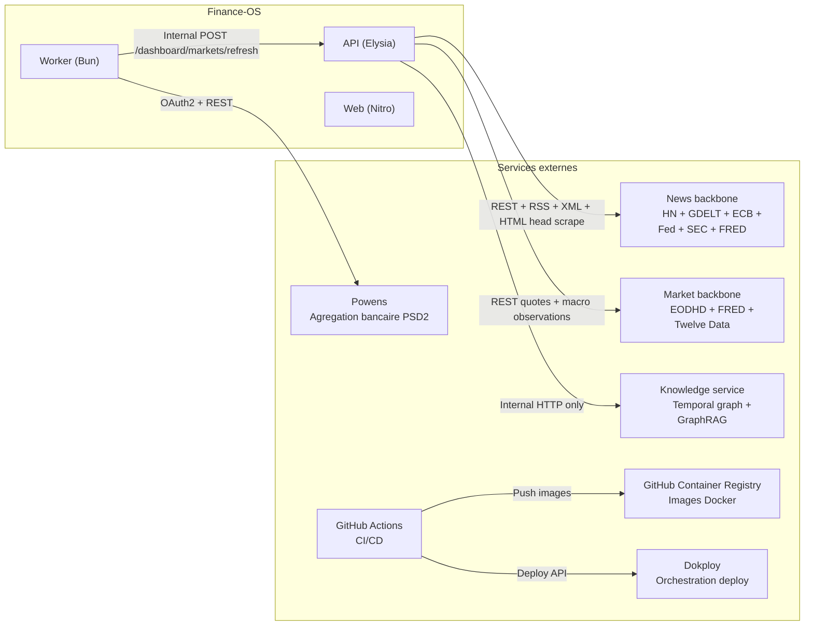

# Finance-OS -- Services Externes

> **Derniere mise a jour** : 2026-04-26
> **Maintenu par** : agents (Claude, Codex) + humain
> Documenter ici tout nouveau service externe integre.

---

## Vue d'ensemble

---

## 0. Internal knowledge service -- Temporal GraphRAG

| Detail | Valeur |
|---|---|
| **Type** | Service interne FastAPI + backends graph/vector |
| **Role** | Memoire temporelle explicable pour l'AI Advisor |
| **URL** | `KNOWLEDGE_SERVICE_URL` (`http://knowledge-service:8011` en Docker prod) |
| **Auth** | Reseau interne + appels API admin/demo gardes par `apps/api` |
| **Backends cibles** | Neo4j (graph), Qdrant (hybrid vector/sparse), fallback local JSON |
| **Consommateur** | API advisor knowledge routes |

Regles:

- jamais expose publiquement; public ingress reste `apps/web`
- demo = fixtures deterministes, aucune mutation
- admin = donnees persistables, fail-soft si service indisponible
- pas de secrets, codes Powens, tokens provider ou PII brute dans les logs/payloads
- pas de trading execution; les concepts trading sont knowledge-only

---

## 1. Powens -- Agregation bancaire

| Detail | Valeur |
|---|---|
| **Type** | API REST + OAuth2 |
| **Role** | Agregation de comptes et transactions bancaires (PSD2) |
| **Base URL** | `POWENS_BASE_URL` (ex: `https://xxx-sandbox.biapi.pro`) |
| **Auth** | OAuth2 Code Grant + Client Credentials |
| **Package interne** | `@finance-os/powens` (`packages/powens/`) |
| **Consommateurs** | API (callback, connect-url), Worker (sync) |
| **Dashboard** | [https://console.powens.com](https://console.powens.com) |

### Endpoints utilises

| Methode | Endpoint | Usage |
|---|---|---|
| `POST` | `/auth/token/access` | Echange code OAuth -> access token |
| `GET` | `/users/me/connections/{connectionId}/accounts?all=true` | Liste des comptes par connexion |
| `GET` | `/users/me/accounts/{accountId}/transactions?min_date=...&max_date=...&limit=...&offset=...` | Transactions paginee par compte |

### Securite
- **Client ID + Secret** : stockes en variable d'env, jamais exposes cote client
- **Access tokens** : chiffres AES-256-GCM avant stockage DB (`APP_ENCRYPTION_KEY`)
- **Callback state** : signe HMAC-SHA256 avec TTL 10 min (anti-CSRF)
- **Retry** : 2 tentatives max sur 408/429/5xx, backoff exponentiel (250ms * attempt)
- **Timeout** : 30 secondes par requete

### Variables d'env requises
- `POWENS_CLIENT_ID`, `POWENS_CLIENT_SECRET`, `POWENS_BASE_URL`, `POWENS_DOMAIN`
- `POWENS_REDIRECT_URI_PROD` (requis en production)
- `APP_ENCRYPTION_KEY` (chiffrement tokens)

### Kill-switches
- `EXTERNAL_INTEGRATIONS_SAFE_MODE` : desactive toutes les syncs
- `POWENS_SYNC_DISABLED_PROVIDERS` : desactive par provider

---

## 2. Backbone news / signaux macro-financiers

Le domaine news consomme plusieurs sources gratuites ou quasi-gratuites cote API.

Le principe produit reste identique:

- `GET /dashboard/news` = lecture cache-only
- `POST /dashboard/news/ingest` = collecte live explicite
- le worker peut declencher des ingestions recurrentes via l'API interne

### 2.1 Hacker News Algolia

| Detail | Valeur |
|---|---|
| **Type** | API REST publique |
| **Role** | Tech / startup / AI / internet finance |
| **URL** | `https://hn.algolia.com/api/v1/search_by_date` |
| **Auth** | aucune |
| **Consommateur** | API news provider `hn_algolia` |
| **Notes** | source secondaire, utile pour signaux techno et model releases |

### 2.2 GDELT DOC 2.0

| Detail | Valeur |
|---|---|
| **Type** | API REST publique |
| **Role** | Media global, geopolitique, macro, politique publique |
| **URL** | `https://api.gdeltproject.org/api/v2/doc/doc` |
| **Auth** | aucune |
| **Consommateur** | API news provider `gdelt_doc` |
| **Notes** | backbone large couverture; a rate-limiter prudemment |

### 2.3 ECB RSS

| Detail | Valeur |
|---|---|
| **Type** | RSS / XML public |
| **Role** | Press releases, speeches, stat press, blog, publications |
| **URLs typiques** | `/rss/press.html`, `/rss/statpress.html`, `/rss/pub.html`, `/rss/blog.html` |
| **Auth** | aucune |
| **Consommateur** | API news provider `ecb_rss` |

### 2.4 ECB Data Portal

| Detail | Valeur |
|---|---|
| **Type** | API data publique |
| **Role** | Releases et series macro structurees |
| **URL** | `https://data-api.ecb.europa.eu/service/data/...` |
| **Auth** | aucune |
| **Consommateur** | API news provider `ecb_data` |
| **Notes** | desactive par defaut, active via series explicites |

### 2.5 Federal Reserve RSS

| Detail | Valeur |
|---|---|
| **Type** | RSS / XML public |
| **Role** | Monetary policy, speeches, press releases |
| **URLs typiques** | `press_monetary.xml`, `press_all.xml`, `speeches_and_testimony.xml` |
| **Auth** | aucune |
| **Consommateur** | API news provider `fed_rss` |

### 2.6 SEC EDGAR / data.sec.gov

| Detail | Valeur |
|---|---|
| **Type** | API / JSON public |
| **Role** | Filings primaires, submissions, watchlist corporate |
| **URL** | `https://data.sec.gov/` |
| **Auth** | aucune cle |
| **Consommateur** | API news provider `sec_edgar` |
| **Notes** | `User-Agent` explicite requis; respecter fair access SEC |

### 2.7 FRED

| Detail | Valeur |
|---|---|
| **Type** | API REST |
| **Role** | Macro structuree (rates, CPI, jobs, yields) |
| **URL** | `https://api.stlouisfed.org/fred/series/observations` |
| **Auth** | `FRED_API_KEY` |
| **Consommateur** | API news provider `fred` |
| **Notes** | desactive par defaut sans cle |

### 2.8 Open Graph / metadata article

| Detail | Valeur |
|---|---|
| **Type** | Fetch HTML head uniquement |
| **Role** | Cards premium, canonical URL, OG image, favicon, JSON-LD |
| **Auth** | aucune |
| **Consommateur** | `scrape-article-metadata.ts` |
| **Notes** | pas de headless browser; timeout et max bytes stricts |

### 2.9 Notes d'usage

- Les providers sont touches a l'ingestion, pas a chaque lecture.
- Chaque provider peut etre coupe individuellement par flag.
- La source produit de verite pour l'architecture news est [NEWS-FETCH.md](NEWS-FETCH.md).
- `Alpha Vantage` reste hors backbone par defaut.
- `NewsAPI` gratuit n'est pas retenu comme dependance coeur.

---

## 2.10 Backbone marches & macro

Le domaine marches suit le meme principe que news:

- `GET /dashboard/markets/*` = lecture cache-only
- `POST /dashboard/markets/refresh` = collecte live explicite
- le worker peut declencher un refresh recurrent via l'API interne
- aucune cle provider ni appel provider cote web

### 2.10.1 EODHD

| Detail | Valeur |
|---|---|
| **Type** | API REST |
| **Role** | Source primaire globale pour prix EOD / differees |
| **URLs** | `https://eodhd.com/api/eod/{SYMBOL}` ; docs: `https://eodhd.com/financial-apis/api-for-historical-data-and-volumes/` |
| **Auth** | `EODHD_API_KEY` |
| **Consommateur** | API market refresh service |
| **Notes** | Le plan free expose 20 appels/jour et 1 an d'historique EOD gratuit; EODHD rappelle aussi que les donnees ne sont pas necessairement real-time ni exactes pour le trading. |

### 2.10.2 Twelve Data

| Detail | Valeur |
|---|---|
| **Type** | API REST |
| **Role** | Overlay optionnel plus frais sur certains symboles US |
| **URLs** | `https://api.twelvedata.com/quote`, `https://api.twelvedata.com/time_series`, docs: `https://twelvedata.com/docs` |
| **Auth** | `TWELVEDATA_API_KEY` |
| **Consommateur** | API market refresh service |
| **Notes** | Le plan Basic affiche 8 credits API par minute et 800/jour; la couverture gratuite globale reste partielle, donc Twelve Data n'est pas utilise comme source globale primaire. |

### 2.10.3 FRED (macro)

| Detail | Valeur |
|---|---|
| **Type** | API REST |
| **Role** | Source officielle pour series macro structurees |
| **URL** | `https://api.stlouisfed.org/fred/series/observations` |
| **Auth** | `FRED_API_KEY` |
| **Consommateur** | API market refresh service, API news provider `fred` |
| **Notes** | Cle enregistree obligatoire; la meme cle sert au domaine news et au domaine marches. |

### 2.10.4 Strategie de merge / fallback

- EODHD fournit le baseline global EOD / differe.
- Twelve Data n'ecrase qu'un symbole US explicitement eligible et seulement quand une quote exploitable est disponible.
- FRED ne sert qu'aux series macro.
- Chaque quote persiste `provider`, `baseline_provider`, `overlay_provider`, `source_mode`, `source_delay_label`, `source_reason`, `quote_as_of`, `captured_at`.
- Les `GET /dashboard/markets/*` ne touchent jamais les providers live: ils lisent PostgreSQL ou basculent vers un fixture deterministic en demo / fallback admin.

### 2.10.5 Limites produit assumees

- Pas de crypto dans cette feature.
- Les indices globaux sont souvent representes par des ETF proxies quand le mapping gratuit d'un indice cash est trop fragile.
- Les donnees EOD / differees doivent etre affichees comme telles dans l'UI, sans ambiguite.

---

## 3. Web Push Protocol -- Notifications

| Detail | Valeur |
|---|---|
| **Type** | Web Push API (RFC 8030) |
| **Role** | Notifications push navigateur |
| **Auth** | VAPID (Voluntary Application Server Identification) |
| **Consommateur** | API (routes `/notifications/push/*`) |

### Etat actuel
- Stockage subscription en Redis (endpoint, cles p256dh/auth, expiration)
- Opt-in/opt-out gere cote serveur
- **Delivery reelle non implementee** : le provider externe (`PUSH_DELIVERY_PROVIDER_URL`) n'est pas encore branche
- Preview/test disponible

### Variables d'env
- `PUSH_VAPID_PUBLIC_KEY`, `PUSH_VAPID_PRIVATE_KEY` : `npx web-push generate-vapid-keys`
- `PUSH_DELIVERY_PROVIDER_URL` : URL du service de delivery (optionnel)

---

## 4. Conseiller IA -- LLM Providers

| Detail | Valeur |
|---|---|
| **Type** | APIs LLM serveur uniquement |
| **Role** | Daily brief structure, relabel transaction, chat grounded, challenger |
| **Providers actifs** | OpenAI, Anthropic |
| **Etat** | Production app-level integration, cost-tracked |

### OpenAI

| Detail | Valeur |
|---|---|
| **Usage** | classification, daily brief, grounded chat |
| **Auth** | `AI_OPENAI_API_KEY` |
| **Config** | `AI_OPENAI_*` |
| **Client** | `packages/ai/src/providers/openai-responses-client.ts` |

### Anthropic

| Detail | Valeur |
|---|---|
| **Usage** | challenger / contre-analyse |
| **Auth** | `AI_ANTHROPIC_API_KEY` |
| **Config** | `AI_ANTHROPIC_*` |
| **Client** | `packages/ai/src/providers/anthropic-messages-client.ts` |

### Gouvernance

- Aucun secret LLM cote client
- Les prix sont versionnes dans `packages/ai/src/pricing/registry.ts`
- Les usages/couts sont traces dans `ai_model_usage` et `ai_cost_ledger`
- Le mode recommande actuel reste manuel-first via `/dashboard/advisor/manual-refresh-and-run`
- Les flags UI restent:
  - `VITE_AI_ADVISOR_ENABLED`
  - `VITE_AI_ADVISOR_ADMIN_ONLY`
- Les flags serveur incluent:
  - `AI_ADVISOR_ENABLED`
  - `AI_CHAT_ENABLED`
  - `AI_CHALLENGER_ENABLED`
  - `AI_RELABEL_ENABLED`

### Providers prepares mais non actives

- slot provider local pour Gemma / on-prem
  - role cible: normalisation/reformulation deterministe de texte non critique
  - role cible: fallback de synthese en mode degrade quand les providers payants sont indisponibles
  - role cible: sandbox local pour evaluer prompts et gardes-fous avant activation production
- ingestion Twitter/X
- extension crypto

---

## 5. GitHub Container Registry (GHCR)

| Detail | Valeur |
|---|---|
| **Type** | Container registry |
| **Role** | Stockage images Docker |
| **URL** | `ghcr.io/bigzoo92/finance-os` |
| **Auth** | `GHCR_TOKEN` (GitHub Actions secret) |

### Usage
- 3 images poussees par release : `web`, `api`, `worker`
- Tags : `vX.Y.Z` + `sha-<commit>` (immutables, jamais `latest`)
- Declenche par GitHub Actions sur `git tag v*`

---

## 6. GitHub Actions

| Detail | Valeur |
|---|---|
| **Type** | CI/CD |
| **Role** | Build, test, deploy |
| **Workflows** | `ci.yml` (validation), `release.yml` (build + deploy) |

### Workflows

**CI** (`ci.yml`) :
- Trigger : push main, PRs, workflow_call
- Steps : frozen lockfile install -> lint -> typecheck -> test -> build

**Release** (`release.yml`) :
- Trigger : tag `v*`, manual dispatch
- Steps : CI rerun -> Docker build multi-stage -> Push GHCR -> Sync Dokploy -> Deploy -> Smoke tests

---

## 7. Dokploy

| Detail | Valeur |
|---|---|
| **Type** | Orchestrateur Docker Compose |
| **Role** | Deploiement et gestion des services |
| **Auth** | `DOKPLOY_API_KEY` (GitHub Actions secret) |

### Usage
- Service type : Docker Compose (source Raw, pas de rebuild)
- Compose sync : GitHub Actions met a jour le compose + env via API Dokploy
- Deploy trigger : `compose.deploy` via API Dokploy
- Rollback : changer `APP_IMAGE_TAG` vers un tag precedent

---

## 8. PostgreSQL

| Detail | Valeur |
|---|---|
| **Type** | Base de donnees relationnelle |
| **Version** | 16-alpine |
| **ORM** | Drizzle ORM |
| **Deploiement** | Container Docker dans le compose |

### Usage
- Stockage principal : comptes, transactions, connexions, objectifs, news, actifs
- Migrations automatiques au demarrage (`RUN_DB_MIGRATIONS=true`)
- Schema-as-code dans `packages/db/src/schema/`

---

## 9. Redis

| Detail | Valeur |
|---|---|
| **Type** | Cache in-memory + message broker |
| **Version** | 7-alpine |
| **Client** | node-redis via `@finance-os/redis` |
| **Deploiement** | Container Docker dans le compose |

### Structures de donnees utilisees

| Cle | Type Redis | Usage | Retention |
|---|---|---|---|
| `powens:jobs` | List (RPUSH/BLPOP) | Job queue sync | Consommee en continu |
| `powens:lock:connection:{id}` | String (SET EX) | Lock par connexion | TTL 15 min |
| `powens:metrics:sync:count:{date}` | String (INCR) | Compteur syncs/jour | 3 jours |
| `powens:metrics:powens_calls:count:{date}` | String (INCR) | Compteur appels API Powens | 3 jours |
| `powens:metrics:sync:runs` | List | Historique sync runs | 30 jours, max 40 |
| `powens:metrics:sync:run:{id}` | Hash | Metadata d'un sync run | 30 jours |
| `notifications:push:settings` | Hash | Etat opt-in/permission | Permanent |
| `notifications:push:subscription` | Hash | Subscription WebPush | Permanent |
| `auth:rate_limit:login:{ip}` | String (INCR, EX) | Rate limiting login | TTL 60s |
| `powens:sync:cooldown:{connectionId}` | String (SET EX) | Cooldown sync manuelle | TTL configurable |

---

## Matrice recapitulative

| Service | Statut | Auth | Gratuit | Critique |
|---|---|---|---|---|
| Powens | **Actif** | OAuth2 + Client Credentials | Non (compte requis) | Oui (donnees bancaires) |
| News backbone (HN/GDELT/ECB/Fed/SEC/FRED) | **Actif** | Mixte selon provider | Oui / cle FRED optionnelle | Non (cache-first, best-effort) |
| Market backbone (EODHD/FRED/Twelve Data) | **Actif** | Cle(s) serveur | Oui / partiel selon plan | Non (cache-first, best-effort) |
| Web Push | **Configure** | VAPID | Oui | Non |
| LLM / IA | **Non integre** | -- | -- | Non |
| GHCR | **Actif** | Token GitHub | Oui (repos publics) | Non (build-time) |
| GitHub Actions | **Actif** | Built-in | Oui (limites free tier) | Non (CI/CD) |
| Dokploy | **Actif** | API Key | Self-hosted | Oui (deploy) |
| PostgreSQL | **Actif** | Connection string | Self-hosted | Oui (stockage) |
| Redis | **Actif** | Connection string | Self-hosted | Oui (queue + cache) |
