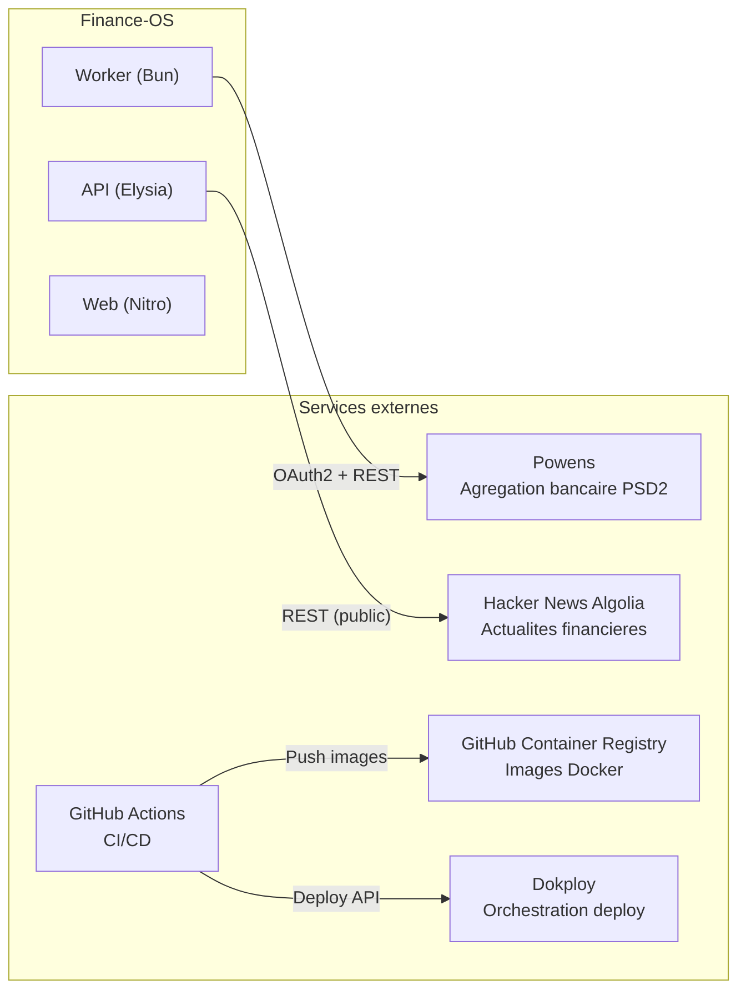

# Finance-OS -- Services Externes

> **Derniere mise a jour** : 2026-04-08
> **Maintenu par** : agents (Claude, Codex) + humain
> Documenter ici tout nouveau service externe integre.

---

## Vue d'ensemble

---

## 1. Powens -- Agregation bancaire

| Detail | Valeur |
|---|---|
| **Type** | API REST + OAuth2 |
| **Role** | Agregation de comptes et transactions bancaires (PSD2) |
| **Base URL** | `POWENS_BASE_URL` (ex: `https://xxx-sandbox.biapi.pro`) |
| **Auth** | OAuth2 Code Grant + Client Credentials |
| **Package interne** | `@finance-os/powens` (`packages/powens/`) |
| **Consommateurs** | API (callback, connect-url), Worker (sync) |
| **Dashboard** | [https://console.powens.com](https://console.powens.com) |

### Endpoints utilises

| Methode | Endpoint | Usage |
|---|---|---|
| `POST` | `/auth/token/access` | Echange code OAuth -> access token |
| `GET` | `/users/me/connections/{connectionId}/accounts?all=true` | Liste des comptes par connexion |
| `GET` | `/users/me/accounts/{accountId}/transactions?min_date=...&max_date=...&limit=...&offset=...` | Transactions paginee par compte |

### Securite
- **Client ID + Secret** : stockes en variable d'env, jamais exposes cote client
- **Access tokens** : chiffres AES-256-GCM avant stockage DB (`APP_ENCRYPTION_KEY`)
- **Callback state** : signe HMAC-SHA256 avec TTL 10 min (anti-CSRF)
- **Retry** : 2 tentatives max sur 408/429/5xx, backoff exponentiel (250ms * attempt)
- **Timeout** : 30 secondes par requete

### Variables d'env requises
- `POWENS_CLIENT_ID`, `POWENS_CLIENT_SECRET`, `POWENS_BASE_URL`, `POWENS_DOMAIN`
- `POWENS_REDIRECT_URI_PROD` (requis en production)
- `APP_ENCRYPTION_KEY` (chiffrement tokens)

### Kill-switches
- `EXTERNAL_INTEGRATIONS_SAFE_MODE` : desactive toutes les syncs
- `POWENS_SYNC_DISABLED_PROVIDERS` : desactive par provider

---

## 2. Hacker News Algolia API -- Actualites financieres

| Detail | Valeur |
|---|---|
| **Type** | API REST publique (pas d'auth) |
| **Role** | Source d'actualites financieres |
| **URL** | `https://hn.algolia.com/api/v1/search_by_date?query=finance&tags=story` |
| **Consommateur** | API (route `/dashboard/news`) |
| **Gratuit** | Oui, pas de cle API |

### Fonctionnement
- Requete simple sans authentification
- Filtrage par pertinence finance (regex : crypto, ETF, macro, marches)
- Deduplication SHA256 sur `titre + URL`
- Stockage cache PostgreSQL avec seuil fraicheur 6h

### Resilience
- Failsoft policy : `live -> cache -> demo`
- En cas d'echec provider : retour donnees cachees
- Feature flag : `LIVE_NEWS_INGESTION_ENABLED`

---

## 3. Web Push Protocol -- Notifications

| Detail | Valeur |
|---|---|
| **Type** | Web Push API (RFC 8030) |
| **Role** | Notifications push navigateur |
| **Auth** | VAPID (Voluntary Application Server Identification) |
| **Consommateur** | API (routes `/notifications/push/*`) |

### Etat actuel
- Stockage subscription en Redis (endpoint, cles p256dh/auth, expiration)
- Opt-in/opt-out gere cote serveur
- **Delivery reelle non implementee** : le provider externe (`PUSH_DELIVERY_PROVIDER_URL`) n'est pas encore branche
- Preview/test disponible

### Variables d'env
- `PUSH_VAPID_PUBLIC_KEY`, `PUSH_VAPID_PRIVATE_KEY` : `npx web-push generate-vapid-keys`
- `PUSH_DELIVERY_PROVIDER_URL` : URL du service de delivery (optionnel)

---

## 4. Conseiller IA -- LLM

| Detail | Valeur |
|---|---|
| **Type** | Local uniquement (pas d'API externe) |
| **Role** | Insights et recommandations financieres |
| **Etat** | MVP -- generation locale, pas d'appel LLM |

### Etat actuel
- Pas d'integration OpenAI, Anthropic, ou autre provider LLM
- Insights generes localement a partir du contexte financier
- Fallback systematique vers donnees mock
- Feature flags : `VITE_AI_ADVISOR_ENABLED`, `VITE_AI_ADVISOR_ADMIN_ONLY`

---

## 5. GitHub Container Registry (GHCR)

| Detail | Valeur |
|---|---|
| **Type** | Container registry |
| **Role** | Stockage images Docker |
| **URL** | `ghcr.io/bigzoo92/finance-os` |
| **Auth** | `GHCR_TOKEN` (GitHub Actions secret) |

### Usage
- 3 images poussees par release : `web`, `api`, `worker`
- Tags : `vX.Y.Z` + `sha-<commit>` (immutables, jamais `latest`)
- Declenche par GitHub Actions sur `git tag v*`

---

## 6. GitHub Actions

| Detail | Valeur |
|---|---|
| **Type** | CI/CD |
| **Role** | Build, test, deploy |
| **Workflows** | `ci.yml` (validation), `release.yml` (build + deploy) |

### Workflows

**CI** (`ci.yml`) :
- Trigger : push main, PRs, workflow_call
- Steps : frozen lockfile install -> lint -> typecheck -> test -> build

**Release** (`release.yml`) :
- Trigger : tag `v*`, manual dispatch
- Steps : CI rerun -> Docker build multi-stage -> Push GHCR -> Sync Dokploy -> Deploy -> Smoke tests

---

## 7. Dokploy

| Detail | Valeur |
|---|---|
| **Type** | Orchestrateur Docker Compose |
| **Role** | Deploiement et gestion des services |
| **Auth** | `DOKPLOY_API_KEY` (GitHub Actions secret) |

### Usage
- Service type : Docker Compose (source Raw, pas de rebuild)
- Compose sync : GitHub Actions met a jour le compose + env via API Dokploy
- Deploy trigger : `compose.deploy` via API Dokploy
- Rollback : changer `APP_IMAGE_TAG` vers un tag precedent

---

## 8. PostgreSQL

| Detail | Valeur |
|---|---|
| **Type** | Base de donnees relationnelle |
| **Version** | 16-alpine |
| **ORM** | Drizzle ORM |
| **Deploiement** | Container Docker dans le compose |

### Usage
- Stockage principal : comptes, transactions, connexions, objectifs, news, actifs
- Migrations automatiques au demarrage (`RUN_DB_MIGRATIONS=true`)
- Schema-as-code dans `packages/db/src/schema/`

---

## 9. Redis

| Detail | Valeur |
|---|---|
| **Type** | Cache in-memory + message broker |
| **Version** | 7-alpine |
| **Client** | node-redis via `@finance-os/redis` |
| **Deploiement** | Container Docker dans le compose |

### Structures de donnees utilisees

| Cle | Type Redis | Usage | Retention |
|---|---|---|---|
| `powens:jobs` | List (RPUSH/BLPOP) | Job queue sync | Consommee en continu |
| `powens:lock:connection:{id}` | String (SET EX) | Lock par connexion | TTL 15 min |
| `powens:metrics:sync:count:{date}` | String (INCR) | Compteur syncs/jour | 3 jours |
| `powens:metrics:powens_calls:count:{date}` | String (INCR) | Compteur appels API Powens | 3 jours |
| `powens:metrics:sync:runs` | List | Historique sync runs | 30 jours, max 40 |
| `powens:metrics:sync:run:{id}` | Hash | Metadata d'un sync run | 30 jours |
| `notifications:push:settings` | Hash | Etat opt-in/permission | Permanent |
| `notifications:push:subscription` | Hash | Subscription WebPush | Permanent |
| `auth:rate_limit:login:{ip}` | String (INCR, EX) | Rate limiting login | TTL 60s |
| `powens:sync:cooldown:{connectionId}` | String (SET EX) | Cooldown sync manuelle | TTL configurable |

---

## Matrice recapitulative

| Service | Statut | Auth | Gratuit | Critique |
|---|---|---|---|---|
| Powens | **Actif** | OAuth2 + Client Credentials | Non (compte requis) | Oui (donnees bancaires) |
| HN Algolia | **Actif** | Aucune | Oui | Non (best-effort) |
| Web Push | **Configure** | VAPID | Oui | Non |
| LLM / IA | **Non integre** | -- | -- | Non |
| GHCR | **Actif** | Token GitHub | Oui (repos publics) | Non (build-time) |
| GitHub Actions | **Actif** | Built-in | Oui (limites free tier) | Non (CI/CD) |
| Dokploy | **Actif** | API Key | Self-hosted | Oui (deploy) |
| PostgreSQL | **Actif** | Connection string | Self-hosted | Oui (stockage) |
| Redis | **Actif** | Connection string | Self-hosted | Oui (queue + cache) |
