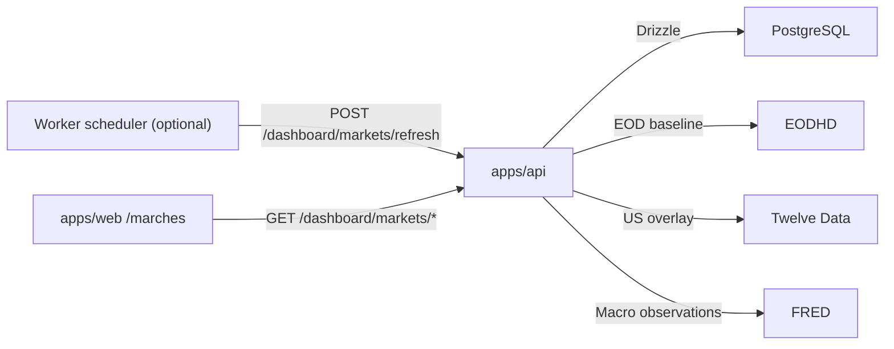

# Finance-OS -- Marches & Macro

> **Derniere mise a jour** : 2026-04-10
> **Maintenu par** : agents (Claude, Codex) + humain
> Source de verite pour la feature `/marches`.

---

## 1. But du domaine

`/marches` fournit une lecture exogene premium du contexte de marche:

- panorama global compact et lisible
- macro officielle et structuree
- watchlist mondiale initiale, configuree en code
- signaux deterministes, sans LLM
- bundle de contexte stable pour un futur advisor IA

Le domaine n'est pas un terminal de trading. Il est concu pour:

- lecture snapshot-first
- provenance explicite
- fraicheur honnete
- dual-path demo/admin strict
- evolution douce vers des providers payants sans rearchitecture

Hors scope actuel:

- crypto
- execution / ordres
- streaming client-side
- modele IA en production

---

## 2. Recherche provider retenue

Les choix ci-dessous ont ete verifies contre les docs publiques officielles avant implementation:

- EODHD docs EOD historical API: `https://eodhd.com/financial-apis/api-for-historical-data-and-volumes/`
- EODHD pricing / free-plan notes: `https://eodhd.com/pricing`
- FRED API docs (series / observations): `https://fred.stlouisfed.org/docs/api/fred/series.html`
- Twelve Data API docs: `https://twelvedata.com/docs`
- Twelve Data pricing: `https://twelvedata.com/pricing`
- Twelve Data support:
  - `https://support.twelvedata.com/en/articles/5615854-credits`
  - `https://support.twelvedata.com/en/articles/12647398-attribution-guidelines-for-using-twelve-data`

### 2.1 Hypotheses retenues

- **EODHD Free** est traite comme un baseline global EOD / differe. Le plan gratuit expose 20 appels par jour et 1 an d'historique EOD. Les docs EODHD rappellent aussi que les donnees ne sont pas necessairement real-time ni adaptees au trading.
- **FRED** est la source officielle macro. Une cle enregistree est requise. Le endpoint `fred/series/observations` suffit au MVP.
- **Twelve Data Free** est traite comme un overlay optionnel US. Le plan Basic affiche 8 credits API par minute et 800/jour. La couverture gratuite globale n'est pas consideree comme assez fiable pour devenir la source primaire du domaine.
- Aucun wrapper tiers n'est utilise: fetch HTTP natif uniquement.

### 2.2 Pourquoi cette combinaison

- EODHD couvre facilement un petit univers mondial de proxies / ETF / Euronext.
- FRED apporte une source macro officielle et stable.
- Twelve Data ameliore ponctuellement la fraicheur sur des symboles US tres liquides sans imposer de dependance globale.

---

## 3. Strategie produit et fraicheur

### 3.1 Strategie de merge / fallback

- `EODHD` = baseline quote source
- `Twelve Data` = overlay seulement si:
  - le symbole est explicitement eligible
  - la quote est exploitable
  - l'overlay apporte une lecture plus fraiche
- `FRED` = macro uniquement

Chaque quote expose:

- `provider`
- `baselineProvider`
- `overlayProvider`
- `mode`: `eod | delayed | intraday`
- `delayLabel`
- `reason`
- `quoteDate`
- `quoteAsOf`
- `capturedAt`
- `freshnessMinutes`
- `isDelayed`

Le systeme n'effectue jamais un merge opaque. Si Twelve Data est utilise, la raison est persistante et visible.

### 3.2 Regles d'honnetete UI

- une quote EOD reste affichee comme EOD
- une quote differee reste affichee comme differee
- un overlay US est marque comme tel
- l'UI prefere une bonne explication de staleness a une illusion de temps reel

---

## 4. Architecture runtime

### 4.1 Lecture

- web SSR -> loader TanStack -> `GET /dashboard/markets/overview`
- API -> PostgreSQL snapshots + cache state
- aucun `GET` ne touche un provider live

### 4.2 Refresh

- manuel: `POST /dashboard/markets/refresh`
- programme: worker optionnel -> POST interne sur le meme endpoint
- demo: interdit
- admin: session admin ou token interne requis

---

## 5. Contrats API

| Endpoint | Role | Notes |
|---|---|---|
| `GET /dashboard/markets/overview` | payload complet pour `/marches` | cache-only, fixture demo/admin fallback |
| `GET /dashboard/markets/watchlist` | vue watchlist simplifiee | stable JSON, pas de provider live |
| `GET /dashboard/markets/macro` | vue macro simplifiee | stable JSON, pas de provider live |
| `GET /dashboard/markets/context-bundle` | bundle IA marche | stable, serialisable |
| `POST /dashboard/markets/refresh` | refresh live du cache | admin/internal only |

### 5.1 Reponse overview

Le contrat overview contient:

- `summary`
- `panorama.items`
- `macro.items`
- `watchlist.items`
- `signals.items`
- `contextBundle`
- `providers`
- `freshness`
- `dataset`

### 5.2 Enveloppes fail-soft

- demo -> fixture deterministic
- admin live ok -> `dataset.source = admin_live`
- admin fallback -> `dataset.source = admin_fallback`
- POST refresh -> enveloppes safe `MARKET_REFRESH_DISABLED`, `MARKET_PROVIDER_UNAVAILABLE`, `MARKET_REFRESH_FAILED`

---

## 6. Persistence

Tables ajoutees dans `packages/db/src/schema/markets.ts`:

| Table | Role |
|---|---|
| `market_quote_snapshot` | quote canonique par instrument |
| `market_macro_observation` | observations macro FRED par date |
| `market_cache_state` | etat global du cache marches |
| `market_provider_state` | health + compteurs par provider |
| `market_context_bundle_snapshot` | dernier bundle IA serialise |

### 6.1 Strategie de dedup / upsert

- quotes: une ligne canonique par `instrument_id`
- macro: upsert par `(series_id, observation_date)`
- provider state: upsert par `provider`
- cache state: ligne singleton `scope = global`
- context bundle: dernier snapshot logique, pas une historisation infinie

### 6.2 Fraicheur

- le cache global garde `lastSuccessAt`, `lastAttemptAt`, `lastFailureAt`, `lastErrorCode`, `lastRequestId`
- chaque provider garde ses compteurs et sa derniere fraicheur
- la staleness UI depend de `MARKET_DATA_STALE_AFTER_MINUTES`

---

## 7. Univers initial

Le mapping est volontairement pragmatique: quand un indice cash global gratuit reste ambigu, on prefere un proxy ETF explicite.

### 7.1 Panorama / watchlist

| Id interne | Instrument | Mapping provider principal | Role |
|---|---|---|---|
| `spy-us` | S&P 500 via SPY | `SPY.US` | panorama US large cap |
| `qqq-us` | Nasdaq 100 via QQQ | `QQQ.US` | panorama growth US |
| `vgk-us` | Europe large caps | `VGK.US` | panorama Europe |
| `ewj-us` | Japon | `EWJ.US` | panorama Asie |
| `iemg-us` | Emergents | `IEMG.US` | panorama EM |
| `cw8-pa` | MSCI World PEA | `CW8.PA` | panorama monde / PEA |
| `meud-pa` | MSCI Europe PEA | `MEUD.PA` | watchlist PEA |
| `aeem-pa` | Emergents PEA | `AEEM.PA` | watchlist PEA |
| `mjp-pa` | Japon PEA | `MJP.PA` | watchlist PEA |
| `air-pa` | Airbus | `AIR.PA` | watchlist Europe equity |
| `mc-pa` | LVMH | `MC.PA` | watchlist Europe equity |
| `ief-us` | US Treasuries 7-10Y | `IEF.US` | cross-asset rates proxy |
| `gld-us` | Or | `GLD.US` | cross-asset commodity proxy |
| `eza-us` | Afrique du Sud | `EZA.US` | couverture Afrique partielle |

### 7.2 Series macro

- `FEDFUNDS`
- `SOFR`
- `DGS2`
- `DGS10`
- `T10Y2Y`
- `CPIAUCSL`
- `UNRATE`

### 7.3 Pourquoi ces series

- elles couvrent taux directeurs, taux courts, courbe des taux, inflation et marche du travail
- elles restent officielles, lisibles et peu couteuses a rafraichir
- elles suffisent pour un premier moteur de signaux deterministes

---

## 8. MarketContextBundle

Le bundle a pour but de servir de surface stable pour un futur advisor IA.

### 8.1 Champs principaux

- `generatedAt`
- `coverageSummary`
- `quoteFreshness`
- `keyMovers`
- `marketBreadth`
- `marketRegimeHints`
- `macroRegime`
- `ratesSummary`
- `inflationSummary`
- `laborSummary`
- `riskFlags`
- `anomalies`
- `warnings`
- `watchlistHighlights`
- `providerProvenance`
- `confidence`

### 8.2 Ce que le bundle garantit

- structure stable et serialisable
- provenance et fraicheur par provider
- separation explicite entre faits, heuristiques et caveats
- compatibilite demo/admin

### 8.3 Ce que le bundle ne garantit pas

- aucune verite de marche temps reel
- aucune recommandation d'investissement
- aucune execution
- aucune inference LLM aujourd'hui

---

## 9. Moteur de signaux

Les signaux sont deterministes et locaux:

- regime taux courts eleves vs baisse
- inflation en refroidissement / rechauffement
- spread 10Y-2Y plus pentu ou plus inverse
- surperformance relative US vs Europe
- alertes de fraicheur ou couverture partielle

Les signaux s'appuient sur:

- variations de quotes
- observations macro comparees a la periode precedente
- key movers et breadth de la watchlist

---

## 10. UX et dataviz

Choix retenus:

- D3 pour les graphes
- peu de graphiques, mais forts
- dark premium aligne Finance-OS
- badges source / fraicheur au premier niveau
- motion discrete, non bloquante

Visualisations du MVP:

- heat strip panorama
- relative performance ribbon
- sparklines macro
- signal board / provenance legend

Etats a couvrir:

- loading
- empty
- degraded
- error
- offline
- permission-gated

---

## 11. Demo / admin

### Demo

- aucun acces DB
- aucun appel EODHD / FRED / Twelve Data
- fixture deterministic credible
- UI read-only

### Admin

- lecture snapshot-first depuis PostgreSQL
- refresh explicite ou programme
- fallback admin fixture possible si cache/live indisponible
- requestId, health provider et stale metadata conserves

---

## 12. Variables d'environnement

Variables cle:

- `MARKET_DATA_ENABLED`
- `MARKET_DATA_REFRESH_ENABLED`
- `MARKET_DATA_EODHD_ENABLED`
- `MARKET_DATA_TWELVEDATA_ENABLED`
- `MARKET_DATA_FRED_ENABLED`
- `MARKET_DATA_US_FRESH_OVERLAY_ENABLED`
- `MARKET_DATA_FORCE_FIXTURE_FALLBACK`
- `MARKET_DATA_STALE_AFTER_MINUTES`
- `MARKET_DATA_DEFAULT_WATCHLIST_IDS`
- `MARKET_DATA_FRED_SERIES_IDS`
- `EODHD_API_KEY`
- `TWELVEDATA_API_KEY`
- `FRED_API_KEY`
- `MARKET_DATA_AUTO_REFRESH_ENABLED`
- `MARKET_DATA_REFRESH_INTERVAL_MS`

Reference detaillee: [ENV-REFERENCE.md](ENV-REFERENCE.md)

---

## 13. Evolution future

Pour monter en gamme sans tout refaire:

- remplacer quelques proxies par indices cash verifies si le plan provider le permet
- ajouter plus de series macro FRED ou une source BCE structuree separee
- brancher un provider payant plus frais sans changer le contrat quote, grace au triplet baseline/overlay/provenance
- injecter `MarketContextBundle` dans le futur advisor IA sans re-wirer l'UI ou les tables

Le MVP assume volontairement une couverture partielle mais honnete.
