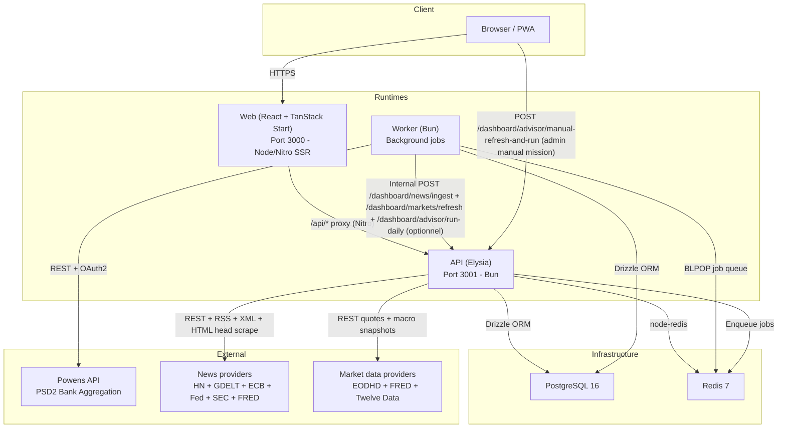
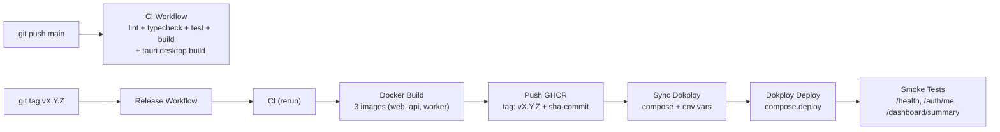
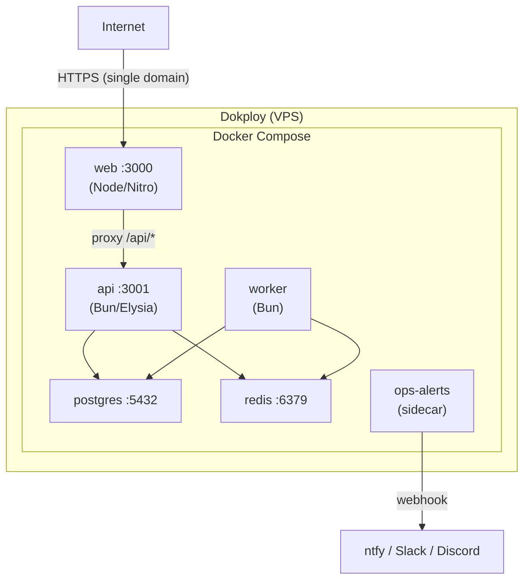
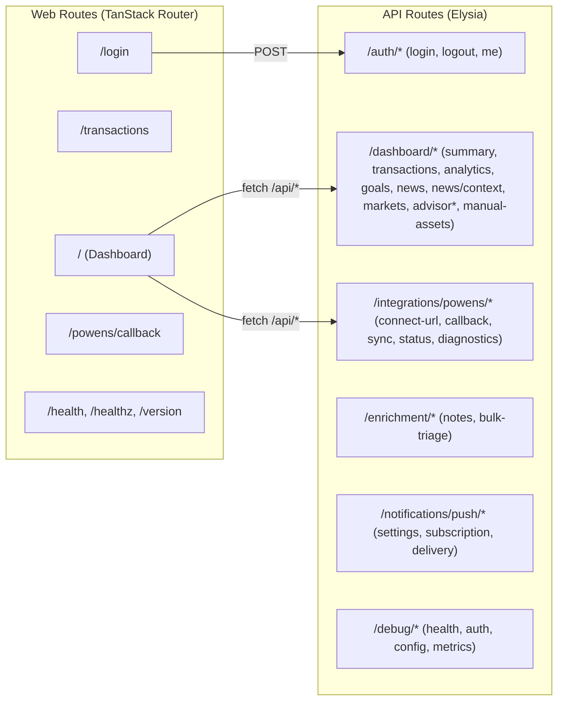
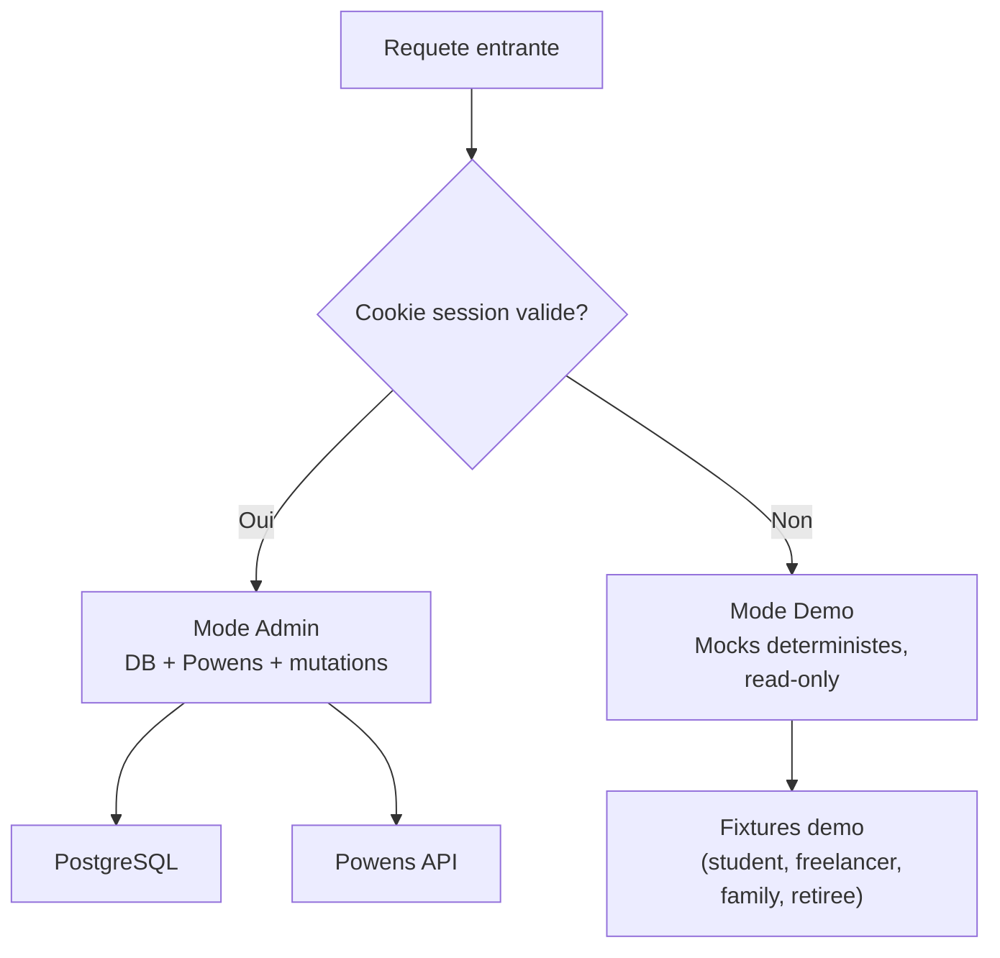
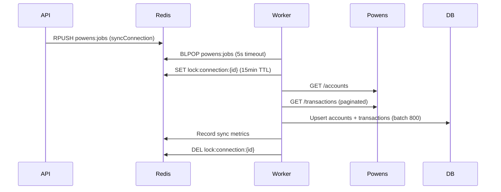

# Finance-OS -- Stack Technique

> **Derniere mise a jour** : 2026-04-15
> **Maintenu par** : agents (Claude, Codex) + humain
> Toute modification structurelle de la stack doit etre refletee ici.

---

## Vue d'ensemble

Finance-OS est un **cockpit de finances personnelles** self-hosted, mono-utilisateur.
Architecture monorepo avec 4 runtimes (Web, API, Worker, Desktop Tauri) et packages partages.



---

## Monorepo

```
finance-os/
  apps/
    web/          # Frontend - React 19, TanStack Start, Nitro SSR
    api/          # Backend  - Elysia sur Bun
    worker/       # Jobs     - Consumer Redis sur Bun
    desktop/      # Shell natif - Tauri 2 (reuse apps/web)
  packages/
    ui/           # Design system - shadcn/ui + Radix + Tailwind v4
    db/           # Schema + migrations - Drizzle ORM + PostgreSQL
    env/          # Validation env vars - Zod schemas centralises
    ai/           # Providers LLM, prompts, schemas, pricing, budget, evals
    finance-engine/ # Moteur deterministe finance/quant
    powens/       # Client Powens - HTTP client + crypto AES-256-GCM
    redis/        # Wrapper Redis - node-redis
    prelude/      # Utilitaires - Logger JSON structure, helpers
    config-ts/    # Configs TypeScript partagees (base, web, server)
  infra/
    docker/       # Dockerfile multi-stage, compose dev
  docs/           # Documentation technique et contexte
  .github/
    workflows/    # CI (ci.yml) + Release (release.yml)
```

---

## Stack par couche

### Frontend (apps/web)

| Technologie | Version | Role |
|---|---|---|
| **React** | 19 | UI framework |
| **TanStack Start** | latest | SSR framework (Nitro server) |
| **TanStack Router** | latest | File-based routing avec loaders |
| **TanStack Query** | latest | Server state, cache, prefetch SSR |
| **TanStack Store** | latest | Micro state (toasts) |
| **Tailwind CSS** | 4.1 | Utility-first CSS |
| **shadcn/ui** | new-york style | Composants UI (Radix primitives) |
| **CVA** | latest | Class Variance Authority - variants |
| **Framer Motion** | 12+ (motion/react) | Page transitions, layout animations |
| **tw-animate-css** | 1.3+ | Animations CSS via Tailwind |
| **D3.js** | latest | Visualisations custom SVG pour dashboard et marches |
| **@t3-oss/env-core** | latest | Validation env vars client |
| **Zod** | 4.1 | Schema validation |
| **Vite** | latest | Bundler + dev server |
| **Nitro** | latest | Server SSR (proxy API, cache headers) |

**Runtime** : Node.js 22 (SSR via Nitro)

### Backend API (apps/api)

| Technologie | Version | Role |
|---|---|---|
| **Elysia** | latest | HTTP framework TypeScript |
| **Drizzle ORM** | latest | Query builder type-safe |
| **node-redis** | latest | Client Redis |
| **Cheerio** | latest | Extraction metadata `<head>` / Open Graph |
| **fast-xml-parser** | latest | Parsing RSS/XML institutionnel |
| **Zod** | 4.1 | Validation payloads |

**Runtime** : Bun 1.2+

### Worker (apps/worker)

| Technologie | Role |
|---|---|
| **Bun** | Runtime |
| **node-redis** | BLPOP consumer (job queue) |
| **Drizzle ORM** | Acces DB |
| **@finance-os/powens** | Client Powens + crypto |
| **Internal HTTP scheduler** | Declenche les ingestions news et refresh marches cache-first |


### Desktop shell (apps/desktop)

| Technologie | Version | Role |
|---|---|---|
| **Tauri** | 2.x | Shell desktop autour de `apps/web` |
| **Rust** | stable | Runtime natif (window lifecycle + logs structures) |
| **Tauri CLI** | 2.x | workflow dev/build desktop + mobile scaffold |

**Runtime** : WebView natif (desktop), sans logique produit dupliquee.

### Base de donnees

| Technologie | Version | Role |
|---|---|---|
| **PostgreSQL** | 16-alpine | Stockage principal |
| **Drizzle ORM** | latest | Schema-as-code, migrations |
| **Drizzle Kit** | latest | CLI migrations |

### Cache & Queue

| Technologie | Version | Role |
|---|---|---|
| **Redis** | 7-alpine | Job queue (lists), metriques (counters), locks (TTL keys), push subscriptions (hashes) |

### Securite & Crypto

| Technologie | Role |
|---|---|
| **PBKDF2-SHA256** | Hash mot de passe (210k iterations, 32 bytes, timing-safe) |
| **Argon2** | Support legacy (via Bun.password) |
| **HMAC-SHA256** | Signature session cookies + callback state Powens |
| **AES-256-GCM** | Chiffrement tokens Powens at rest |

---

## Pipeline CI/CD



| Etape | Outil | Details |
|---|---|---|
| **CI** | GitHub Actions | local parity via `pnpm check:ci` (main suite + `desktop:build`), with GitHub still running a dedicated `tauri-validate` job for the desktop shell |
| **Build** | Docker multi-stage | 4 targets: build-web, web, api, worker |
| **Registry** | GHCR | Images immutables, jamais `latest` |
| **Deploy** | Dokploy | Docker Compose, source Raw (pas de rebuild) |
| **Smoke** | `smoke-prod.mjs` | /health, /auth/me, /dashboard/summary, /powens/status |
| **Rollback** | Tag precedent | Changer `APP_IMAGE_TAG` dans Dokploy |

---

## Architecture de deploiement



**Reseau** : `finance_os_internal` (bridge Docker)
**Volumes** : `postgres_data`, `redis_data`, `worker_run_v2`
**Domaine** : single public domain pointe vers `web`, l'API est interne uniquement

---

## Routage HTTP



Toutes les routes API sont enregistrees en double : `/path` et `/api/path` pour compatibilite proxy.

Posture recommandee actuelle:

- advisor manuel-first via `POST /dashboard/advisor/manual-refresh-and-run`
- `AI_DAILY_AUTO_RUN_ENABLED=false`
- `WORKER_AUTO_SYNC_ENABLED=false`

---

## Dual-Path : Demo / Admin



**Invariant critique** : chaque feature doit supporter les deux chemins. Aucun acces DB ou provider en mode demo.

---

## Job Queue (Redis)



---

## Versions cles

| Outil | Version |
|---|---|
| Node.js | 22.15.0 |
| Bun | 1.2.22 |
| pnpm | 10.15.0 |
| TypeScript | strict, ES2023, exactOptionalPropertyTypes |
| PostgreSQL | 16-alpine |
| Redis | 7-alpine |


Voir aussi: [TAURI-DESKTOP.md](TAURI-DESKTOP.md) pour les commandes desktop/mobile scaffolding.
